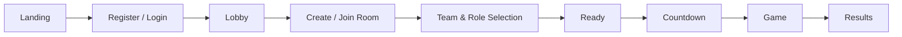
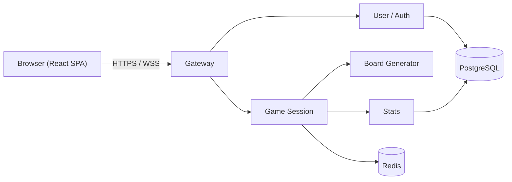

# ft_transcendence

A real-time multiplayer word-association game inspired by Codenames, built as part of 42's `ft_transcendence` project.

Players register an account, create or join a room, split into two teams, and play a server-authoritative round of clue-giving and card-guessing over a live WebSocket connection.

---

## Table of Contents

- [Overview](#overview)
- [Highlights](#highlights)
- [Game Flow](#game-flow)
- [How the Game Works](#how-the-game-works)
- [Architecture](#architecture)
- [Technology Stack](#technology-stack)
- [Frontend Architecture](#frontend-architecture)
- [Backend Services](#backend-services)
- [Authentication](#authentication)
- [Realtime Model](#realtime-model)
- [Data Model / State Ownership](#data-model--state-ownership)
- [API Contracts](#api-contracts)
- [UI / Design System](#ui--design-system)
- [Repository / Branch Guide](#repository--branch-guide)
- [Development](#development)
- [Environment & Security](#environment--security)
- [Project Requirements](#project-requirements)
- [Status](#status)
- [Academic Context](#academic-context)

---

## Overview

`ft_transcendence` is a browser-based, real-time multiplayer game for four or more players split into two teams. Every player registers an account with email, username and password — there is no anonymous play. From the lobby, a player creates or joins a room, picks a team (`RED`/`BLUE`) and a role (`SPYMASTER`/`OPERATIVE`), and marks themselves ready. Once every start condition is satisfied the room counts down and the match begins.

Gameplay itself is fully server-authoritative: the backend owns the board, the turn order, the score and the win condition, and streams state to clients over WebSocket. Beyond the core game, the project includes profiles with avatars, a friends list with presence, direct chat, and match history with a simple leveling stat. A short reconnect grace period covers transient disconnects without punishing a player for a dropped connection.

## Highlights

- **Real-time multiplayer rooms** with team/role selection, readiness and countdown, all server-validated.
- **Server-authoritative gameplay** — the frontend never computes a winner; only a terminal server event does.
- **Role-safe game state** — Operatives never receive hidden card information; Spymasters do.
- **Secure, cookie-based authentication** with short-lived and rotating credentials, shared by REST and WebSocket.
- **Reconnect support** — a temporary disconnect does not immediately remove a player from a room or a match.
- **Social features** — friends, presence, direct chat, and per-user profiles with avatars.
- **Match history and stats** — wins, losses and a derived level per player.
- **A custom, responsive UI** built on a hand-authored design token system.

## Game Flow



A room stays open after a match finishes so players can review the result before leaving; there is no in-place rematch — starting again means creating or joining a new room.

## How the Game Works

Each match is played on a 25-card board split between two teams, a set of neutral cards, and a single assassin card. Each team has one **Spymaster**, who can see every card's affiliation, and one or more **Operatives**, who cannot.

- The active team's Spymaster gives a one-word clue and a number, granting their Operatives that many guesses plus one.
- Operatives guess cards one at a time. Guessing their own team's card lets them continue; guessing a neutral card or an opponent's card ends the turn.
- Revealing a team's final card wins the game for that team immediately.
- Revealing the assassin ends the game immediately in favor of the opposing team, regardless of score.

The winner is always determined by a terminal event from the server — a completed set or the assassin — never by comparing scores client-side.

## Architecture



The Gateway is the single public entry point, terminating TLS and validating the session cookie before routing REST and WebSocket traffic to the appropriate service. Game Session owns all live room and match state; Board Generator is a stateless helper it calls at the start of each game; User/Auth owns identity and social data; Stats owns finalized results. PostgreSQL holds durable data and Redis holds ephemeral, in-progress room and game state.

## Technology Stack

| Layer | Technology |
| --- | --- |
| Frontend | React, TypeScript |
| Routing | React Router |
| State | Zustand |
| Styling | CSS custom properties + component-scoped CSS |
| Backend | Go |
| HTTP framework | Gin |
| WebSocket | gorilla/websocket |
| Database | PostgreSQL |
| Ephemeral / realtime state | Redis |
| API contract & testing | Bruno |
| Containers | Docker / Docker Compose |

## Frontend Architecture

The frontend is a feature-based React SPA:

```text
src/
├── app/         router, providers, bootstrap, connection owners
├── layouts/     PublicLayout, LobbyLayout, GameLayout, Footer
├── features/    auth, lobby, room, game, profile, friends, chat, stats
├── shared/      api, websocket, stores, types, ui, constants, utils, styles
└── assets/      icons, fonts, images
```

Dependencies flow one way — `app → layouts → features → shared` — and features never import one another directly; cross-feature needs go through `shared/` or an app-level mount point.

## Backend Services

| Service | Responsibility |
| --- | --- |
| **Gateway** | Public HTTPS/WSS entry point, request routing, WebSocket connection lifecycle, session-cookie validation at the transport layer. |
| **User/Auth** | Accounts, credentials, session issuance, profiles, avatars, friends, presence. |
| **Game Session** | Rooms, membership, team/role/ready state, countdown, authoritative game state, reconnect snapshots, chat delivery. |
| **Board Generator** | Stateless: generates a randomized 25-card board on request. |
| **Stats** | Finalized match results, win/loss records, match history, level. |

## Authentication

Authentication is email/password only, backed by two HttpOnly cookies: a short-lived session credential used on every request, and a longer-lived, single-use refresh credential scoped to the refresh endpoint. Neither credential is ever exposed in a response body or attached manually by client code — the browser's cookie jar handles both REST calls and the WebSocket upgrade automatically, since the whole application is served from a single origin.

## Realtime Model

Once a player joins a room, team selection, readiness, countdown, and all in-game actions happen over a dedicated room WebSocket; a separate per-user WebSocket handles direct chat. Every command is validated server-side, and the server emits events that fully describe the resulting state — clients apply what they receive rather than predicting it locally.

Each client-issued command carries a unique `request_id`, letting the server safely ignore duplicate retries. On (re)connect, a client always receives a fresh, role-safe snapshot rather than a replay of missed events: **Operatives never receive hidden card ownership information**, while Spymasters see the full board. A short grace period tolerates transient disconnects before a player is treated as having left or, mid-match, as having forfeited.

## Data Model / State Ownership

- **PostgreSQL** holds persistent application data: accounts, credentials, profiles, friends, and finalized match results.
- **Redis** holds ephemeral, in-progress state: active room membership, team/role/ready selections, live board and turn state, and presence.

## API Contracts

The `bruno` branch is the canonical REST and WebSocket contract for this project, maintained as a [Bruno](https://www.usebruno.com/) collection. It documents, with concrete request and response examples:

- every REST endpoint's request, response and error shape;
- every WebSocket command and server event, including payloads and permissions;
- validation rules and the full error-code catalog;
- room and game lifecycle behavior, including reconnect and forfeit;
- authentication behavior across REST and WebSocket.

## UI / Design System

The interface uses a custom, game-oriented visual system built on CSS custom properties (design tokens) rather than a UI framework, with reusable, component-scoped styles. The `ui-design` branch holds the design reference: token definitions, mockups and visual assets that inform layout, color and typography across the frontend.

## Repository / Branch Guide

> [!NOTE]
> The `main` branch is intentionally documentation-only and contains just this README. It is the public landing page for the project; implementation lives on dedicated branches.

| Branch | Purpose |
| --- | --- |
| `main` | Public project overview and repository landing page (this branch). |
| `frontend` | React frontend implementation. |
| `bruno` | REST and WebSocket API contract (Bruno collection). |
| `ui-design` | Visual design system, reference mockups and design assets. |

## Development

Each implementation branch documents its own setup. In short:

```bash
git clone git@github.com:melmut-42/ft_transcendence.git
git checkout frontend   # frontend app
git checkout bruno      # API contracts
git checkout ui-design  # design system and assets
```

The full stack (frontend, backend services, PostgreSQL and Redis) is intended to run with a single Docker Compose command; see the `frontend` and `bruno` branches for current setup details.

## Environment & Security

Configuration is provided through environment variables, documented per branch in a committed `.env.example` with no real values. Secrets are never committed. All browser-facing traffic runs over HTTPS/WSS behind a single reverse-proxied origin, session cookies are HttpOnly and scoped appropriately, and input is validated on both the frontend and the backend.

## Project Requirements

The project targets:

- a responsive, single-page web application;
- real-time multiplayer gameplay for four or more players per match;
- persistent user accounts, profiles and statistics;
- secure, cookie-based authentication;
- server-side validation of every game action;
- a fully containerized development and deployment setup.

## Status

The architecture and API contracts are defined, and implementation is being developed across the frontend, backend and design workstreams.

## Academic Context

This project is built as part of 42's common core curriculum.
